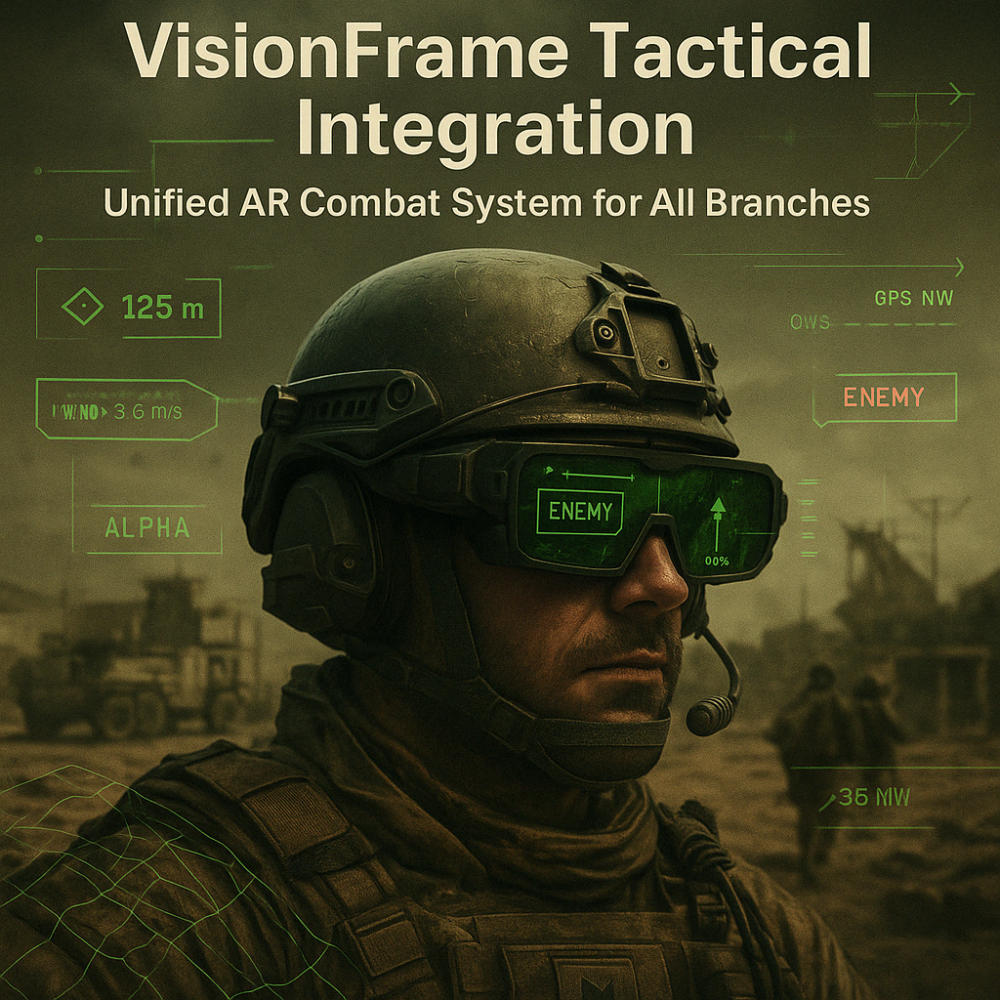
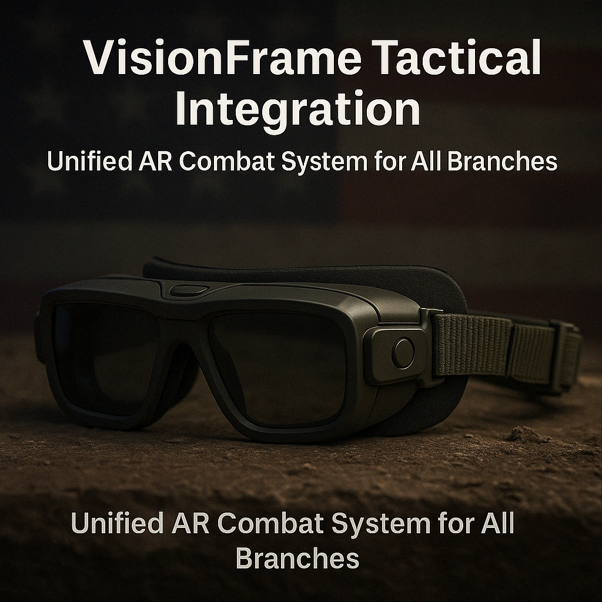
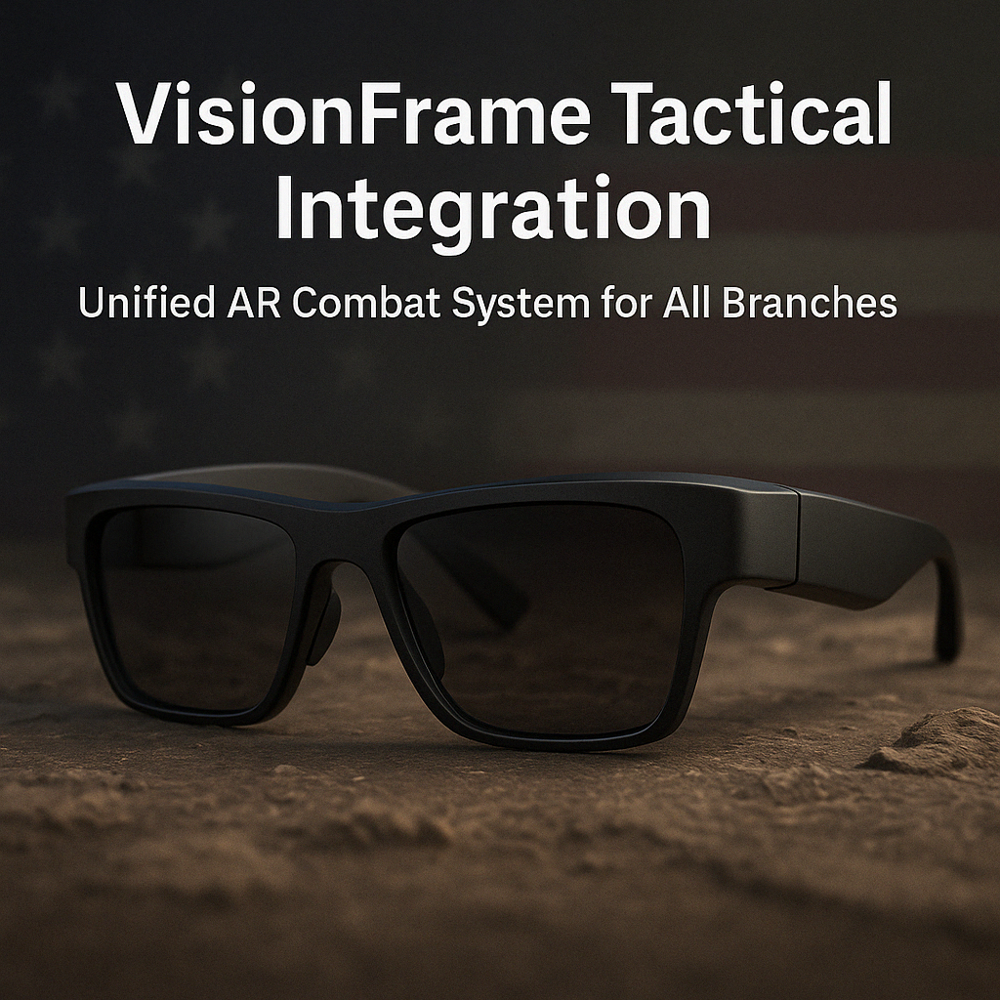

  
  
  

# VisionFrame Tactical Integration

  
  
  

**Next-Gen AR Glasses Engineered for U.S. Military Superiority**

VisionFrame is an advanced AR wearable system designed to replace traditional field tools like radios, binoculars, HUDs, and handheld devices — all in a lightweight, voice- and gesture-controlled headset built for high-stakes tactical environments.

---

## Mission-Driven Innovation

Empowering U.S. Armed Forces with battlefield-ready AR glasses that deliver:

- Real-time tactical awareness
- Fully hands-free operation (voice, eye, gesture)
- Silent communication with encrypted command sync
- Tactical overlays without FOV obstruction
- Engineered for Army, Navy, Air Force, Marines, and Space Force

---

## Core Tactical Capabilities

- **AI-assisted visual targeting & terrain overlays**
- **Silent bone conduction + subvocal communication**
- **Eye + gesture controls (no hands needed)**
- **Squad health + real-time command sync**
- **Adaptive overlays with zero central FOV obstruction**

---

## Battlefield Awareness & Navigation

- Real-time GPS overlays with waypoint marking
- Live terrain manipulation (toggle tree/building transparency)
- Rangefinding with exact meters/yards to targets
- Environmental data: wind speed, temperature, barometric pressure
- Eye-tracked compass and squad position minimap

---

## Health & Threat Monitoring

- Real-time biometric vitals for all team members
- Auto-alerts for critical injuries or status loss
- Visual threat tagging with color-coded threat levels
- AI-powered motion & gunfire detection
- Instant tactical data sharing with command center

---

## Cross-Branch Applications

- Designed for Army, Navy, Air Force, Marines, and Space Force
- Scalable for infantry, aircrew, medics, logistics, and special ops
- Modular software with mission-specific configs
- Rugged, weather-resistant, and adaptable to standard gear
- Seamless integration with military networks and protocols

---

## Tactical Presentation Deck

  

[▶ Download Tactical Deck (PDF)]
Includes full concept, visual structure, and integration strategy.[VisionFrame_Tactical_Deck_Kollman_2025.pdf](https://github.com/user-attachments/files/19817543/VisionFrame_Tactical_Deck_Kollman_2025.pdf)

[VisionFrame_Tactical_Deck_Kollman_2025.pptx](https://github.com/user-attachments/files/19817547/VisionFrame_Tactical_Deck_Kollman_2025.pptx)

---

## Screenshots

  
  
  

---
## Contact

**Stephen Kollman**  
IT Specialist & VisionFrame Developer  
📧 [Stephen.Kollman.Pro@outlook.com](mailto:Stephen.Kollman.Pro@outlook.com)  
🔗 [LinkedIn Profile](https://www.linkedin.com/in/stephen-kollman-589938256/)

---

## License

This project is proprietary and intended for U.S. government collaboration only.  
All rights reserved unless licensed under DoD or federal innovation agreement.

---

## Contribute

Interested in partnering, prototyping, or enhancing VisionFrame?

Military R&D, defense contractors, and field-ready engineers welcome.  
Submit a pull request or contact directly to join the mission.

